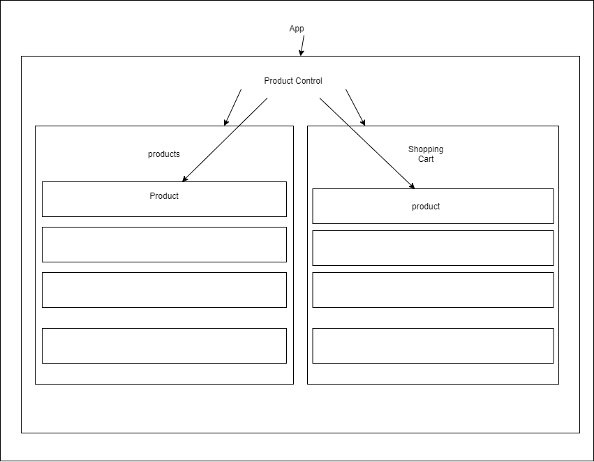

# _Farmers Market_

#### July 1st, 2020

## Description

_Website that displays the produce that will be avaliable at the farmers market each week.
A web application for farmer's market. Customers can see which location & food avalible at this farmers market. The market has different crops in different seasons. Different produce is available in different seasons._

## Setup

_Make sure you have [git version control](https://git-scm.com/downloads) installed on your computer._

1. Click the green 'Clone or Download' button and copy the link / download the zip
2. Open terminal and type... or skip to #4 if you downloaded the zip

**Windows**

```sh
cd desktop
```

Mac & linux

```sh
cd ~/Desktop
```

3.  in terminal type '_git clone {link to repository}_ '

```sh
git clone {link to repository}
```

4. If you downloaded the zip then extract all onto your desktop
5. Open the folder with VSC or an equivalent

## This project was bootstrapped with:
[Create React App](https://github.com/facebook/create-react-app)

## Available Scripts

In the project directory, you can run:

### `npm start`

Runs the app in the development mode.<br />
Open [http://localhost:3000](http://localhost:3000) to view it in the browser.

The page will reload if you make edits.<br />
You will also see any lint errors in the console.

### `npm test`

Launches the test runner in the interactive watch mode.<br />
See the section about [running tests](https://facebook.github.io/create-react-app/docs/running-tests) for more information.

### `npm run build`

Builds the app for production to the `build` folder.<br />
It correctly bundles React in production mode and optimizes the build for the best performance.

The build is minified and the filenames include the hashes.<br />
Your app is ready to be deployed!

See the section about [deployment](https://facebook.github.io/create-react-app/docs/deployment) for more information.

### `npm run eject`

**Note: this is a one-way operation. Once you `eject`, you can’t go back!**

If you aren’t satisfied with the build tool and configuration choices, you can `eject` at any time. This command will remove the single build dependency from your project.

Instead, it will copy all the configuration files and the transitive dependencies (webpack, Babel, ESLint, etc) right into your project so you have full control over them. All of the commands except `eject` will still work, but they will point to the copied scripts so you can tweak them. At this point you’re on your own.

You don’t have to ever use `eject`. The curated feature set is suitable for small and middle deployments, and you shouldn’t feel obligated to use this feature. However we understand that this tool wouldn’t be useful if you couldn’t customize it when you are ready for it.

---

## Specs


<!--  -->

### Behavior Driven Development Spec List

#### Endangered Animals

|                                                               Behavior                                                               |                              Input                               |                       Output                        |
| :----------------------------------------------------------------------------------------------------------------------------------: | :--------------------------------------------------------------: | :-------------------------------------------------: |
|                        The user can view a map of N. America and get info about the biomes of the 3 countries                        |                     'http://localhost:5001/                      |              'Map with hovering text'               |
|                                  The user can click on a country to see a list of selected animals                                   |         'http://localhost:5001/Animals/Index?country=US'         | '"Cards" for each animal with picture, name & link' |
|                                        The user can click on a selected animal to see details                                        | 'http://localhost:5001/Animals/Detail?name=Leopardus%20pardalis' |     'Page with animal details generated by API'     |
| Pages are cached so that after a user visits a country index or individual animal once, it will load faster for subsequent refreshes |         'http://localhost:5001/Animals/Index?country=US'         |               'Loads faster 2nd time'               |
|                                     The user can visit links from home index for additional info                                     |                'click link to Nature Conservancy'                |              'Redirect to Nature.org'               |

---

## Known Bugs

_N/A_ - 7/1/2020

---

## GitHub / gh-pages

WiseFool92.github.io/farmersmarket

---

## Support

_Email: watkins92@gmail.com_

_Email: nitun.2@gmail.com_

---

## Built With

- [React.js](https://reactjs.org/)

## Useful tools

- [free icons @ icons8](https://icons8.com/)
- [free icons @ fontawesome](https://fontawesome.com/)

---

- [Old School Gifs Search](https://gifcities.org/)
- [free images @ unsplash](https://unsplash.com/)

  - **_source.unsplash.com_ will return a random image at a desired size by simply calling the size after the url
    followed by a '?' and a keyword. Example below**

  - _https://source.unsplash.com/400x400/?cat_
  - http://unsplash.it/500/500 - This will just return a random image the size of 500x500

---

- [Flex-box Cheat Sheet](http://yoksel.github.io/flex-cheatsheet/)
- [CSS Grid Cheat Sheet](http://grid.malven.co/)

---

- [CSS Gradient BG Generator](https://mycolor.space/gradient)
- [CSS Basic Gradient Generator](https://cssgradient.io/)

---

- [CSS Dropshadow Generator](https://cssgenerator.org/box-shadow-css-generator.html)

## Learn More

You can learn more in the [Create React App documentation](https://facebook.github.io/create-react-app/docs/getting-started)

---

To learn React, check out the [React documentation](https://reactjs.org/)

---

### Code Splitting

This section has moved here: https://facebook.github.io/create-react-app/docs/code-splitting

---

### Analyzing the Bundle Size

This section has moved here: https://facebook.github.io/create-react-app/docs/analyzing-the-bundle-size

---

### Making a Progressive Web App

This section has moved here: https://facebook.github.io/create-react-app/docs/making-a-progressive-web-app

---

### Advanced Configuration

This section has moved here: https://facebook.github.io/create-react-app/docs/advanced-configuration

---

### Deployment

This section has moved here: https://facebook.github.io/create-react-app/docs/deployment

---

### `npm run build` fails to minify

This section has moved here: https://facebook.github.io/create-react-app/docs/troubleshooting#npm-run-build-fails-to-minify

---

### License

This project is licensed under the MIT License

Copyright (c) 2020 **_Nathan Watkins-Hoagland, Reid Ashwill_**

---